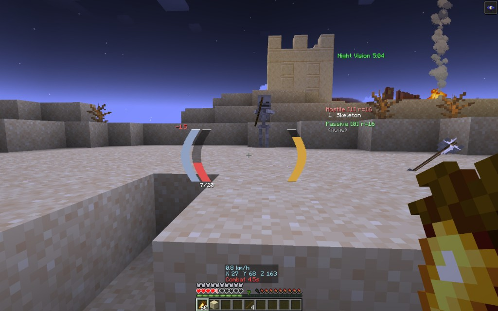

# Center HUD

Client-side modular HUD for Fabric: IceHUD-style bars, entity counters,
scrolling combat text, speed/coords panel, elytra status, and waypoints.

**License:** MIT (jars include the license text). Source is not published;
this repository holds docs, changelog, issues, and release downloads only.

## Supported Minecraft

| Minecraft | Java | Loader |
| --- | --- | --- |
| 26.2 | 25 | Fabric |
| 26.1.2 (also 26.1 / 26.1.1) | 25 | Fabric |
| 1.21.11 | 21 | Fabric |
| 1.21.1 | 21 | Fabric |

## Install

1. Install Fabric Loader for your Minecraft version.
2. Install [Fabric API](https://modrinth.com/mod/fabric-api) and
   [Cloth Config](https://modrinth.com/mod/cloth-config).
3. Drop the matching `centerhud-mc<version>-*.jar` from
   [Releases](https://github.com/skullcrs/centerhud-meta/releases) (or Modrinth)
   into your `mods` folder.
4. Optional: [Mod Menu](https://modrinth.com/mod/modmenu) for in-game config.

## Features (0.3.0)

- Curved or straight player bars (health, absorption, hunger, armor, air, mount)
- Themes, gradients, and optional shader-aware fancy bars
- Scrolling combat text (incoming / outgoing / notify) with crit FX
- Entity counters, look-at target stats, effects list
- Speed / coordinates / facing / combat timer info panel
- Elytra durability HUD and optional cluster bar
- Waypoint arrow + waypoints screen
- In-game drag layout editor (default key: O)
- Options to hide overlapping vanilla HUD elements

## Config

Open Mod Menu -> Center HUD, or edit `config/centerhud.json`.

## Issues

Bugs and requests: [GitHub Issues](https://github.com/skullcrs/centerhud-meta/issues).

## Downloads

- [GitHub Releases](https://github.com/skullcrs/centerhud-meta/releases) (binary jars only)
- [Modrinth](https://modrinth.com/mod/centerhud) (when the listing is live)
